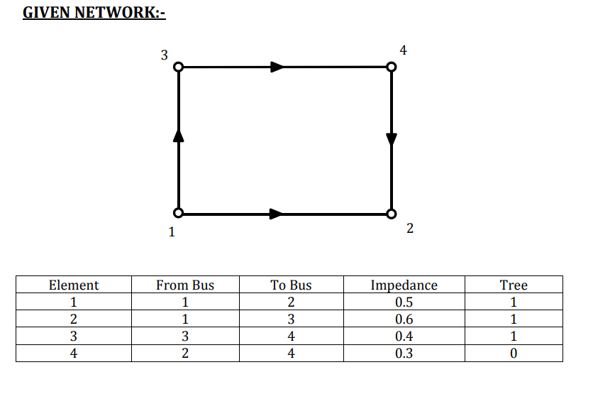
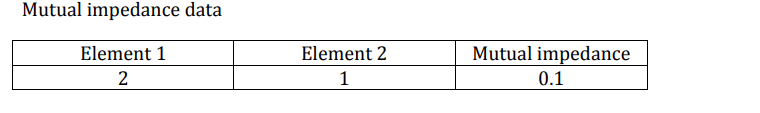
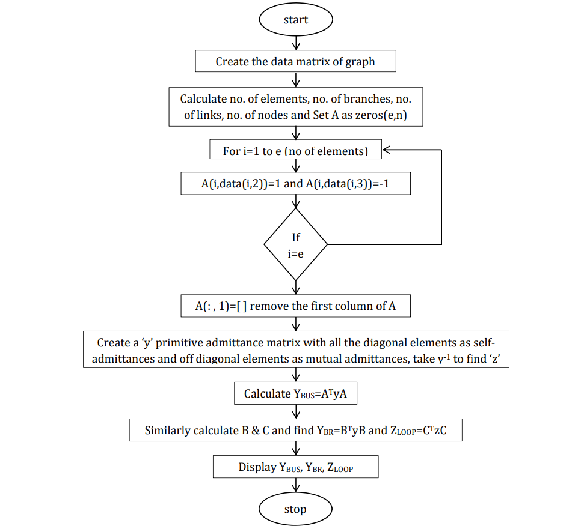
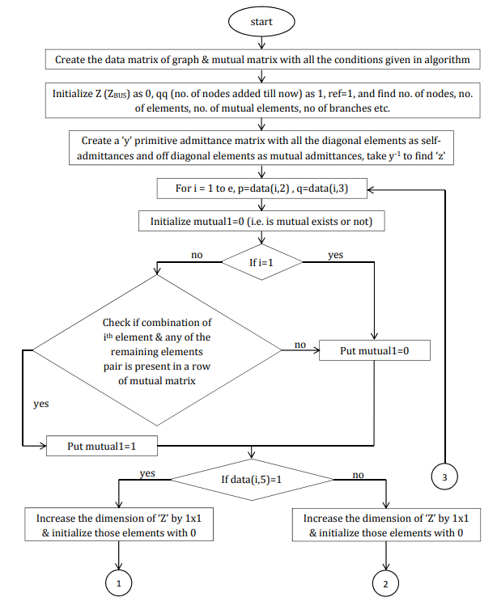
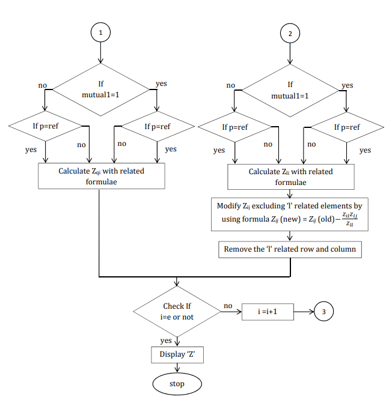
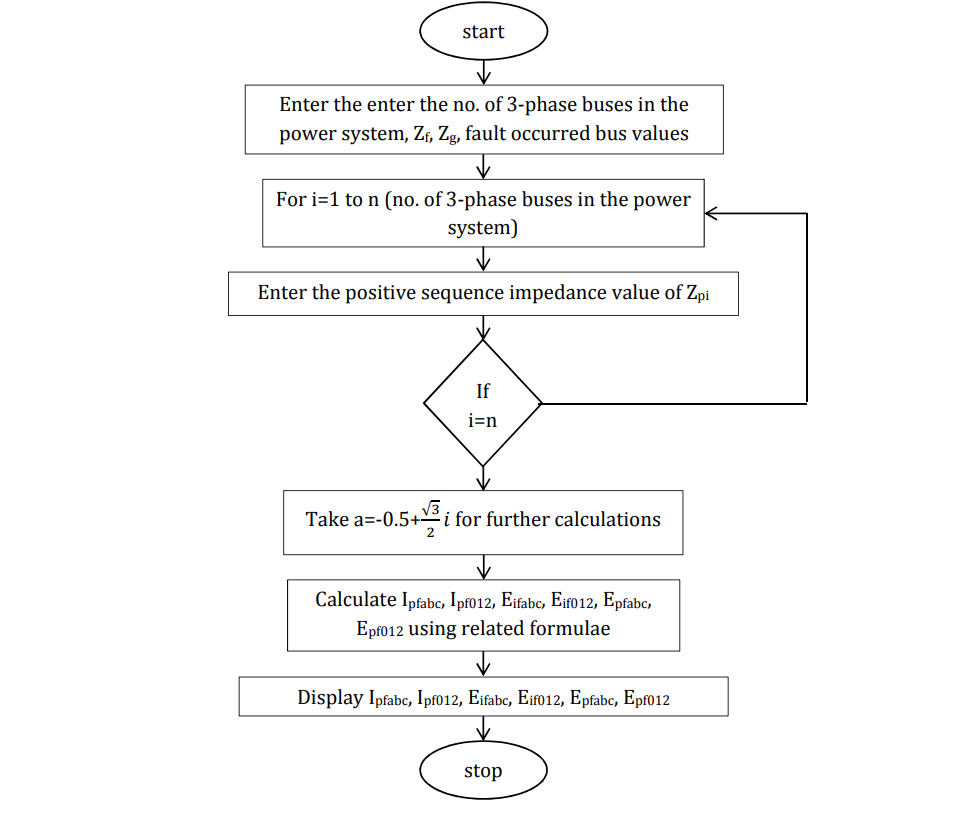

# Program-1

## (A) Single phase lines

### Aim : To find GMD and GMR using matlab code

### Theory

**Geometric Mean Radius (GMR):**  
The GMR represents the effective radius of conductors in a single-phase transmission line bundle. It's calculated as the geometric mean of individual conductor radii. Formula: `GMR = √(r₁ * r₂ * ... * rₙ)`.

**Geometric Mean Distance (GMD):**  
The GMD quantifies conductor spacing's equivalent effect on capacitance and inductance. It's found using `GMD = (d₁ * d₂ * ... * dₙ)^(1/n)`.

Both GMR and GMD influence line parameters. Determine conductor arrangement, plug into formulas, and use these values in line parameter calculations for analyzing transmission line behavior. In practical cases, consider more complexities and simulations for accuracy.

### Code

```Matlab
% SINGLE PHASE LINE
clc;
clear all;
D=input('distance between two conductors = ');
r=input('radius of conductor = ');
GMD=D;GMR=0.7788*r;
GMR
GMD
```

### Result

```Matlab
distance between two conductors = 10
radius of conductor = 2

GMD =

    10


GMR =

    1.5576

```

## (B) Three phase lines

## (i) Symmetrical spacing

### Aim : To find GMD and GMR using matlab code

### Theory

**Three-Phase Symmetrical Spacing:**

For a three-phase symmetrical spacing in a transmission line, the formulas for Geometric Mean Radius (GMR) and Geometric Mean Distance (GMD) are as follows:

**GMR Formula:**
`GMR = √(r₁ * r₂ * ... * rₙ)`.

**GMD Formula:**
`GMD = (d₁ * d₂ * ... * dₙ)^(1/n)`.

### Code

```Matlab
% THREE PHASE SYMMETRICAL LINE
clc;
clear all;
D=input('distance between any two conductors = ');
r=input('radius of conductor = ');
GMD=D;GMR=0.7788*r;
GMR
GMD
```

### Result

```Matlab
distance between two conductors = 45
radius of conductor = 3

GMR =

    2.3364


GMD =

    45

```

## (ii) Asymmetrical spacing

### Aim : To find GMD and GMR using matlab code

### Code

```Matlab
% ASYMETRECAL SPACING
clc;
clear all;
r=input('radius of conductor = ');;
Dab=6;Dac=12;Dbc=6;Dba=Dab;Dca=Dac;Dcb=Dbc;
GMD=(Dab*Dac*Dbc*Dba*Dca*Dcb)^(1/6);
GMR=0.7788*r;
GMR
GMD
```

### Result

```Matlab
radius of conductor = 1.8

GMR =

    1.4018


GMD =

    7.5595

```

## (iii) Bundled Conductor

### Aim : To find GMD and GMR matlab code

### Theory

A **bundled conductor** refers to the arrangement of two or more individual conductors, like wires or cables, grouped together in a parallel configuration. This approach boosts the collective current-carrying capacity, reduces losses linked to skin effect and proximity effect, and curbs electromagnetic interference. Particularly valuable in high-voltage transmission lines, bundled conductors facilitate efficient power conveyance over extensive distances while curtailing energy dissipation.

The expanded surface area of these conductors also improves heat dispersion, ensuring dependable and consistent electrical transmission crucial for contemporary power grids.

### Code

```Matlab
% BUNDLED CONDUCTOR
clc;
clear all;
Daa=0.016*0.7788;
Da1a1=Daa;
Daa1=0.45;Da1a=0.45;
GMR=(Daa*Daa1*Da1a1*Da1a)^(1/4);
dab=12;dab1=12.45;da1b=11.55;da1b1=12;
Dab=(dab*dab1*da1b*da1b1)^(1/4);
Dbc=Dab;
dca=24;dca1=23.55;dc1a=24.45;dc1a1=24;
Dca=(dca*dca1*dc1a*dc1a1)^(1/4);
GMD=(Dab*Dbc*Dca)^(1/3);
GMR
GMD
```

### Result

```Matlab
radius of conductor = 1.8

GMR =

    0.0749


GMD =

   15.1151

```

## (iii) Double Circuit Lines

### Aim : To find GMD and GMR matlab code

### Theory

A **double circuit line** pertains to an arrangement where two separate sets of conductors, often with their own phases or functions, are operated in parallel on the same transmission tower or infrastructure. This design optimizes the utilization of transmission infrastructure and land resources.

Double circuit lines find significant application in high-voltage transmission networks, providing an efficient means to transmit large amounts of electricity across extended distances.

### Code

```Matlab
% DOUBLE CIRCUIT VERTICAL CONFIGURATION
clc;
clear all;
E0=8.854187817*10^-12;
r=input('enter radius of conductor = ');
h=input('enter the distance between b and b1 = ');
m=input('enter distance between a and b1 = ');
n=input('enter distance between a and a1 or c and c1 = ');
D=input('enter the distance between a and b1 = ');
r1=0.7788*r;
Dsa=sqrt(r1*n);Dsb=sqrt(r1*h);Dsc=Dsa;
GMR=(Dsa*Dsb*Dsc)^(1/3);
Dab=sqrt(D*m);
Dbc=Dab;Dca=sqrt(2*D*h);
GMD=(Dab*Dbc*Dca)^(1/3);
GMR
GMD
```

### Result

```Matlab
enter radius of conductor = 2
enter the distance between b and b1 = 10
enter distance between a and b1 = 20
enter distance between a and a1 or c and c1 = 30
enter the distance between a and b1 = 10

GMR =

    5.6920


GMD =

   14.1421

```

## (B)Find inductance and capacitance

## (i) Single phase lines

### Aim : To find inductance and capacitance using matlab code.

### Theory

Calculating **capacitance** and **inductance** using Geometric Mean Distance (GMD) and Geometric Mean Radius (GMR) involves formulas that account for conductor arrangement. For capacitance per unit length (C'), use `C' = 2πε / ln(GMD / GMR)`, considering permittivity (ε). For inductance per unit length (L'), use `L' = μ / (2π) * ln(GMD / GMR)`, with permeability (μ). GMD is the geometric average of conductor spacings, while GMR represents the geometric mean of conductor radii. These calculations provide insights into electrical parameters based on conductor geometry, aiding in designing efficient power systems.

### Code

```Matlab
% SINGLE PHASE LINE
clc;
clear all;
D=input('distance between two conductors = ');
r=input('radius of conductor = ');
E0=8.854187817*10^-12;
GMD=D;GMR=0.7788*r;
L=4*(10^-7)*log(GMD/GMR);
disp('SINGLE PHASE LINE INDUCTANCE AND CAPACITANCE');
L
C=2*pi*E0/(log(GMD/GMR));

C
```

### Result

```Matlab
distance between two conductors = 56
radius of conductor = 1.7
SINGLE PHASE LINE INDUCTANCE AND CAPACITANCE
L = 1.4979e-06
C = 1.4856e-11

```

## (ii) Three phase symmetrical lines

### Aim : To find inductance and capacitance using matlab code.

### Code

```Matlab
% THREE PHASE LINE
clc;
clear all;
D=input('distance between any two conductors = ');
r=input('radius of conductor = ');
E0=8.854187817*10^-12;
GMD=D;GMR=0.7788*r;
L=2*(10^-7)*log(GMD/GMR)*(10^3);    % H/Km per phase
disp('THREE PHASE LINE INDUCTANCE AND CAPACITANCE');
L
C=2*pi*E0/(log(GMD/GMR));
C
```

### Result

```Matlab
distance between any two conductors = 34
radius of conductor = 1.6
THREE PHASE LINE INDUCTANCE AND CAPACITANCE
L =   6.6127e-04
C = 1.6826e-11

```

## (iii) Three phase asymmetrical lines

### Aim : To find inductance and capacitance using matlab code.

### Code

```Matlab
% ASYMETRECAL SPACING
clc;
clear all;
r=1.81*10^-2;
E0=8.854187817*10^-12;
Dab=6;Dac=12;Dbc=6;Dba=Dab;Dca=Dac;Dcb=Dbc;
GMD=(Dab*Dac*Dbc*Dba*Dca*Dcb)^(1/6);
GMR=0.7788*r;
L=2*(10^-7)*log(GMD/GMR)*(10^3);    % H/Km per phase
disp('ASYMETRICAL SPACING INDUCTANCE AND CAPACITANCE');
L
C=2*pi*E0/(log(GMD/GMR));
C
```

### Result

```Matlab
ASYMETRICAL SPACING INDUCTANCE AND CAPACITANCE
L =    0.0013
C =   8.8521e-12

```

## (iii) Bundled Conductors

### Aim : To find inductance and capacitance using matlab code.

### Code

```Matlab
% BUNDLED CONDUCTOR
clc;
clear all;
E0=8.854187817*10^-12;
Daa=0.016*0.7788;
Da1a1=Daa;
Daa1=0.45;Da1a=0.45;
GMR=(Daa*Daa1*Da1a1*Da1a)^(1/4);
dab=12;dab1=12.45;da1b=11.55;da1b1=12;
Dab=(dab*dab1*da1b*da1b1)^(1/4);
Dbc=Dab;
dca=24;dca1=23.55;dc1a=24.45;dc1a1=24;
Dca=(dca*dca1*dc1a*dc1a1)^(1/4);
GMD=(Dab*Dbc*Dca)^(1/3);
L=2*(10^-7)*log(GMD/GMR)*(10^3);    % H/Km per phase
disp('BUNDLED CONDUCTOR INDUCTANCE AND CAPACITANCE');
L
C=2*pi*E0/(log(GMD/GMR));
C
r=sqrt(2)*0.016;r1=0.7788*r;
GMR=r1;
Dab=12;Dbc=12;Dca=24;Dba=12;Dcb=12;Dac=24;
GMD=(Dab*Dbc*Dca*Dba*Dcb*Dac)^(1/6);
L=2*(10^-7)*log(GMD/GMR)*(10^3);    % H/Km per phase
disp('INDUCTANCE AND CAPACITANCE WITH ONLY ONE CONDUCTOR PER
PHASE');
L
C=2*pi*E0/(log(GMD/GMR));
C
```

### Result

```Matlab
distance between any two conductors = 34
radius of conductor = 1.6
THREE PHASE LINE INDUCTANCE AND CAPACITANCE
L =   6.6127e-04
C = 1.6826e-11

```

## (iii) Three phase asymmetrical lines

### Aim : To find inductance and capacitance using matlab code.

### Code

```Matlab
% ASYMETRECAL SPACING
clc;
clear all;
r=1.81*10^-2;
E0=8.854187817*10^-12;
Dab=6;Dac=12;Dbc=6;Dba=Dab;Dca=Dac;Dcb=Dbc;
GMD=(Dab*Dac*Dbc*Dba*Dca*Dcb)^(1/6);
GMR=0.7788*r;
L=2*(10^-7)*log(GMD/GMR)*(10^3);    % H/Km per phase
disp('ASYMETRICAL SPACING INDUCTANCE AND CAPACITANCE');
L
C=2*pi*E0/(log(GMD/GMR));
C
```

### Result

```Matlab
BUNDLED CONDUCTOR INDUCTANCE AND CAPACITANCE
L =    0.0011
C =   1.0482e-11

INDUCTANCE AND CAPACITANCE WITH ONLY ONE CONDUCTOR PER PHASE
L =   0.0014
C =   8.2363e-12

```

## (iv) Double circuit vertical configuration

### Aim : To find inductance and capacitance using matlab code.

### Code

```Matlab
% DOUBLE CIRCUIT VERTICAL CONFIGURATION
clc;
clear all;
E0=8.854187817*10^-12;
r=input('enter radius of conductor = ');
h=input('enter the distance between b and b1 = ');
m=input('enter distance between a and b1 = ');
n=input('enter distance between a and a1 or c and c1 = ');
D=input('enter the distance between a and b1 = ');
r1=0.7788*r;
Dsa=sqrt(r1*n);Dsb=sqrt(r1*h);Dsc=Dsa;
GMR=(Dsa*Dsb*Dsc)^(1/3);
Dab=sqrt(D*m);
Dbc=Dab;Dca=sqrt(2*D*h);
GMD=(Dab*Dbc*Dca)^(1/3);
L=2*(10^-7)*log(GMD/GMR)*(10^3);    % H/Km per phase
disp('INDUCTANCE AND CAPACITANCE OF DOUBLE CIRCUIT VERTICAL
CONFIGURATION');
L
C=2*pi*E0/(log(GMD/GMR));
C
```

### Result

```Matlab
enter radius of conductor = 1.6
enter the distance between b and b1 = 12
enter distance between a and b1 = 12
enter distance between a and a1 or c and c1 = 12
enter the distance between a and b1 = 12
INDUCTANCE AND CAPACITANCE OF DOUBLE CIRCUIT VERTICAL
CONFIGURATION
L =  2.4960e-04
C =  4.4578e-11

```

<div style="page-break-after: always"></div>

# Program-2

### Aim : To write a general computer program for n number of buses and elements to develop Bus incidence matrix (A) , Basic cut-set incidence matrix (B) and Basic loop incidence matrix (C).

### Theory

1. **Bus Incidence Matrix (A)**:

   - The Bus Incidence Matrix represents the relationship between buses (nodes) and branches (edges) in an electrical circuit.
   - Each row of matrix A corresponds to a bus, and each column corresponds to a branch.
   - The elements of A indicate whether a branch is incident on a bus. If a branch is connected to a bus, the corresponding entry in A is typically 1; otherwise, it's 0.
   - Bus incidence matrix A has dimensions (n x m), where n is the number of buses and m is the number of branches.

2. **Basic Cut-Set Incidence Matrix (B)**:

   - The Basic Cut-Set Incidence Matrix represents the relationship between cut-sets (sets of branches that, when removed, disconnect the circuit) and branches.
   - Each row of matrix B corresponds to a cut-set, and each column corresponds to a branch.
   - The elements of B indicate whether a branch is part of a cut-set. If a branch is in a cut-set, the corresponding entry in B is typically 1; otherwise, it's 0.
   - Basic cut-set incidence matrix B has dimensions (k x m), where k is the number of cut-sets and m is the number of branches.

3. **Basic Loop Incidence Matrix (C)**:

   - The Basic Loop Incidence Matrix represents the relationship between loops (closed paths in the circuit) and branches.
   - Each row of matrix C corresponds to a loop, and each column corresponds to a branch.
   - The elements of C indicate whether a branch is part of a loop. If a branch is in a loop, the corresponding entry in C is typically 1; otherwise, it's 0.
   - Basic loop incidence matrix C has dimensions (l x m), where l is the number of loops and m is the number of branches.

### ALGORITHM:

##### START

##### STEP1:

Form data matrices such that they represent line data of the given network
For the above network line data = [element no, from node, to node]

##### STEP2:

Form a zero matrix of order element by nodes

##### STEP3:

Use for loop and for each element choose the from node and to node in the
created matrix and give the value as 1 and -1 respectively

##### STEP4:

Perform STEP3 for all elements to get the Bus incidence matrices

##### STEP5:

Remove the column corresponding to the reference node in the obtained
matrix to get the reduced bus incidence matrices. Thus reduced incidence
matrix A is formed.

##### STEP6

From the reduced incidence matrix select the rows which belong to tree
elements and place them in matrix “Ab” and the rows which belong to link
elements in matrix “Al” .This way we can partition the A matrix into Ab and
Al

##### STEP7

Form augmented matrices of B and C
STOP

### Code

```Matlab
data=[1 1 2;2 1 3;3 1 4;4 5 1;5 2 3;6 4 3;7 5 4;8 2 3;9 3 4;10 4 5];
e=max(data(:,1));
n=max(max(data(:,2)),max(data(:,3)));
b=n-1;
l=e-b;
A=zeros(e,n);
for i=1:e
 A(i,data(i,2))=1;
 A(i,data(i,3))=-1;
end
A %A is complete incidence matrix
A(:,1)=[] % A is incidence matrix
Ab=A(1:b,:);
Al=A(b+1:e,:);
Bl=Al*Ab^(-1);
Ub=eye(b);
B=[Ub;Bl];
B % B is basic cutset matrix
Cb=-(Bl)';
Ul=eye(l);
C=[Cb;Ul];
C % C is basic loop matrix
```

### Result

```Matlab
A =
    -1     0     0     0
     0    -1     0     0
     0     0    -1     0
     0     0     0     1
     1    -1     0     0
     0    -1     1     0
     0     0    -1     1
     1    -1     0     0
     0     1    -1     0
     0     0     1    -1
B =
     1     0     0     0
     0     1     0     0
     0     0     1     0
     0     0     0     1
    -1     1     0     0
     0     1    -1     0
     0     0     1     1
    -1     1     0     0
     0    -1     1     0
     0     0    -1    -1
C =
     1     0     0     1     0     0
    -1    -1     0    -1     1     0
     0     1    -1     0    -1     1
     0     0    -1     0     0     1
     1     0     0     0     0     0
     0     1     0     0     0     0
     0     0     1     0     0     0
     0     0     0     1     0     0
     0     0     0     0     1     0
     0     0     0     0     0     1


```

<div style="page-break-after: always"></div>

# Program-3

### Aim : Write a general computer program to develop Y<sub>bus</sub>, Y<sub>br</sub> and Z<sub>loop</sub> using singular transformation (no mutual coupling)

### Theory




**Y<sub>bus</sub> (Admittance Matrix):**

- Y<sub>bus</sub> represents the nodal admittance matrix of an electrical network.
- It is used in power flow analysis and is crucial for solving network equations to determine voltage magnitudes and phase angles at various nodes.
- The elements of Y<sub>bus</sub> represent the total admittance (conductance and susceptance) between nodes in the network.

**Y<sub>br</sub> (Branch Admittance Matrix):**

- Y<sub>br</sub> is a submatrix of Y<sub>bus</sub> that represents the admittance matrix for individual branches or lines in the network.

### ALGORITHM:

##### START

##### STEP1:

Create two matrices to represent line data and the mutual impedance data
line data contains information about [element number, from node , to node,
element impedance] whereas mutual data contains [element, mutual
element, mutual impedance].

##### STEP2:

Form the reduced bus incidence matrix A.

##### STEP3:

Form the primitive impedance matrix ‘z’. Where z is a matrix of order
element by element in which diagonal elements are self-impedances and off
diagonal elements are mutual impedances.

##### STEP4:

Find primitive admittance matrix ‘y’ using the relation y = z<sup> -1</sup>

##### STEP5:

Using the given relation Y<sub>bus</sub> = A<sup>t</sup>YA

##### STOP

### Code

```Matlab
clc;
clear all;
data=[1 1 2 0.5;3 1 3 0.6;2 3 4 0.4;4 2 4 0.3];
mutual=[2 1 0.1];
m=length(mutual(:,1)); %no of mutual elements
z=diag(data(:,4));
for i=1:m
 z(mutual(i,1),mutual(i,2))=mutual(i,3);
 z(mutual(i,2),mutual(i,1))=mutual(i,3);
end
y=z^-1;
e=max(data(:,1));
n=max(max(data(:,2)),max(data(:,3)));
A=zeros(e,n);
for i=1:e
 A(i,data(i,2))=1;
 A(i,data(i,3))=-1;
end
A(:,1)=[]
Ybus=A'*y*A %bus admittance matrix
Zbus=Ybus^-1 %bus impedance matrix
```

### Flowchart:



### Result

```Matlab
A =

    -1     0     0
     0    -1     0
     0     1    -1
     1     0    -1

Ybus =

    5.4023   -0.3448   -3.3333
   -0.3448    4.2241   -2.5000
   -3.3333   -2.5000    5.8333

Zbus =

    0.4000    0.2250    0.3250
    0.2250    0.4437    0.3187
    0.3250    0.3187    0.4937


```

<div style="page-break-after: always"></div>

# Program-4

### Aim : Write a general computer program to develop Z<sub>bus</sub> by using Z<sub>bus</sub> building algorithm using addition of both link and branch

### Theory


**Z<sub>BUS</sub> Building Algorithm**

The Z<sub>BUS</sub> building algorithm is used in power system analysis to construct the Z<sub>BUS</sub> matrix, which represents the impedance matrix of an electrical network. This matrix is essential for analyzing various aspects of power systems, including fault analysis, load flow calculations, and transient stability studies.

The algorithm involves the addition of both link and branch impedance values to build the complete Z<sub>BUS</sub> matrix for the network. Here's an outline of the steps involved:

1. **Initialize Z<sub>BUS</sub> Matrix:**

   - Begin with an initial empty Z<sub>BUS</sub> matrix of size N x N, where N is the number of nodes in the electrical network.

2. **Process Branch Impedances:**

   - For each branch or transmission line in the network:
     - Identify the "from" and "to" nodes of the branch.
     - Calculate the branch impedance (Z<sub>branch</sub>) based on the physical parameters of the line, such as resistance (R) and reactance (X).
     - Update the Z<sub>BUS</sub> matrix by adding the branch impedance values at the corresponding positions.
       - Increment Z<sub>BUS</sub>(from, from) by Z<sub>branch</sub>.
       - Increment Z<sub>BUS</sub>(to, to) by Z<sub>branch</sub>.
       - Decrement Z<sub>BUS</sub>(from, to) by Z<sub>branch</sub>.
       - Decrement Z<sub>BUS</sub>(to, from) by Z<sub>branch</sub>.

3. **Process Link Impedances:**

   - For each link or connection between nodes (e.g., transformers, reactors):
     - Calculate the link impedance (Z<sub>link</sub>) based on its parameters.
     - Update the Z<sub>BUS</sub> matrix by adding the link impedance values at the corresponding positions.
       - Increment Z<sub>BUS</sub>(from, from) by Z<sub>link</sub>.
       - Increment Z<sub>BUS</sub>(to, to) by Z<sub>link</sub>.
       - Decrement Z<sub>BUS</sub>(from, to) by Z<sub>link</sub>.
       - Decrement Z<sub>BUS</sub>(to, from) by Z<sub>link</sub>.

4. **Finalize Z<sub>BUS</sub> Matrix:**

   - After processing all branches and links, the Z<sub>BUS</sub> matrix is complete and represents the impedance matrix of the entire network.

5. **Z<sub>BUS</sub> Utilization:**
   - The resulting Z<sub>BUS</sub> matrix can be used for various power system analysis tasks, including solving load flow equations, fault analysis, and transient stability studies.

The Z<sub>BUS</sub> building algorithm ensures that the impedance values of all network components are correctly incorporated into the matrix, allowing for accurate electrical network analysis.

### ALGORITHM:

##### START

##### STEP1:

Create a data matrix with five columns, i.e., ‘element no’, ‘from bus no’ i.e.
‘p’ node, ‘to bus no’ i.e. ‘q’ node, ‘self-admittance value’, the fifth column consists of only 0 or 1. ‘1’ if the element is a branch, ‘0’ if the element is a
link.

##### STEP2:

The following conditions are to be applied while creating the data matrix.

1. In the data matrix, the element numbering is given in a serial, i.e., as the values of the element no. column proceeds, numbers should go as 1, 2, 3 ….. etc.

2. We have to assume the procedure in the building algorithm as first adding the branches and then adding links. Therefore, in the fifth column, we can find 1’s first and then 0’s.

3. The second column is always considered as the ‘p’ node, and while filling the second and third column elements row-wise, see that the second column element is already present in any of the 2nd or 3rd column elements in the above rows.

##### STEP3:

Create a mutual matrix having three columns i.e. element 1, element 2,
mutual admittance value.

##### STEP4:

Calculate the primitive admittance matrix with all the diagonal elements as
self-admittance values and off diagonal elements as the mutual admittance
values (use the above data and mutual matrices). Find primitive impedance
matrix by inversing the primitive admittance matrix

##### STEP5:

Initialize ‘Z’ (bus impedance) as ‘0’, qq (no of nodes added till now) as 1, ref
(reference) as 1. Find no of elements ‘e’ and no of mutual elements ‘m’
using the data and mutual matrices.

##### STEP6:

Start the ‘for loop’ with i=1 to e (no of elements). Take the corresponding
second and third column elements as ‘p’ and ‘q’. Initialize mutual1
(representing the existence of mutual element or not) with 0.

##### Step7:

Check if i=1, if yes then mutual1=0 because only one element has been
added till now.

##### Step8:

Else initialize c=0 (count of the no of elements having mutual with the
added element) after initializing check the pair of added element and the
remaining each element added till now whether present in any of the rows
in mutual matrix. If the pair is present in any row, then increase c by 1, r
(rho) and s (sigma) as the corresponding 2nd and 3rd column values of that
particular element (other than the added element in the pair found). Then
make mutual1 as 1.

##### Step9:

Check If the added element is a branch or not. This can be checked by
looking at the value of the fifth column of the data matrix. i.e. 1 for branch
and 0 for link

##### Step10:

If it is a branch then make qq=qq+1 (increasing the count), increase the
dimensions of the Z matrix by 1, i.e. one row and column has to be
increased. Initialize the added elements with 0.

##### Step11:

Check if mutual1 is 1 or 0. If it is 1 then Check if p is reference or not. if yes
then apply the corresponding calculation of finding the Zqi and Zqq. Similarly
if p is not a reference then find corresponding Zqi and Zqq values. Do the
same (i.e corresponding formulas for finding Zqi and Zqq) if mutual1 is 0.

##### Step12:

If the added element is a link, then ll=qq+1, increase the dimension of the Z
matrix by 1x1 temporarily, i.e. one row and one column has to be increased.
Initialize the added elements with 0.

##### Step13:

Check if mutual1 is 1 or 0. If it is 1 then Check if p is reference or not. if yes
then apply the corresponding calculation of finding the Zli and Zll. Similarly
if p is not a reference then find corresponding Zli and Zll values. Do the same
(i.e corresponding formulas for finding Zli and Zll) if mutual1 is 0.
Immediately modify the Z matrix values except the link related values and
remove the link related row and column, reducing the dimension of Z.

##### Step14:

Finally the i value comes to e and the loop ends. To display the final Z
matrix simply type Z without any semicolon.

##### STOP

### Flowchart:





### Code

```Matlab
clc;
clear all;
data=[1 1 2 0.5 1;3 1 3 0.6 1;2 3 4 0.4 1;4 2 4 0.3 0];
mutual=[2 1 0.1]; %mutual impedance data (impedance zm between
e1 and e2)
e=length(data(:,1));          %no of elements
Z=0;
qq=1;
m=length(mutual(:,1));
ref=data(1,1);                          %reference node
z=diag(data(:,4));
for i=1:m
    z(mutual(i,1),mutual(i,2))=mutual(i,3);
    z(mutual(i,2),mutual(i,1))=mutual(i,3);
end
y=z^-1;
for i=1:e
    p=data(i,2);
    q=data(i,3);
    mutual1=0;
    if i==1
        mutual1=0;
    else
        c=0;
        for i1=1:i-1
            for ii=1:m
    if ismember(i,mutual(ii,1:2))==1&&ismember(i1,mutual(ii,1:2))==1
                c=c+1;
                v(c)=i1;
                r(c)=data(i1,2);
                s(c)=data(i1,3);
                mutual1=1;
            end
            end
        end
    end
    if data(i,5)==1
        qq=qq+1;
        zz=zeros(1,qq-1);
        Z=[Z zz';zz zeros(1)];
        if mutual1==1
            if p==ref
                for ii=1:qq
                    if ii~=q&&ii~=ref
                      for k=1:c
                      g(c)=y(i,v(c))*(Z(r(c),ii)-Z(s(c),ii));
                      end
                        Z(q,ii)=sum(g)/y(i,i);
                        Z(ii,q)=Z(q,ii);
end
                    for k=1:c
                        g1(c)=y(i,v(c))*(Z(r(c),q)-Z(s(c),q));
                    end
                end
                Z(q,q)=(1+sum(g1))/y(i,i);
            else
                for ii=1:qq
                    if ii~=q&&ii~=ref
                    for k=1:c
                    g(c)=y(i,v(c))*(Z(r(c),ii)-Z(s(c),ii));
                    end
                        Z(q,ii)=Z(p,ii)+sum(g)/y(i,i);
                        Z(ii,q)=Z(q,ii);
                    end
                    for k=1:c
                        g1(c)=y(i,v(c))*(Z(r(c),q)-Z(s(c),q));
                    end
                end
                Z(q,q)=Z(p,q)+(1+sum(g1))/y(i,i);
            end
        else
            if p==ref
                Z(q,q)=z(i,i);
            else
                for ii=1:qq
                    if ii~=q&&ii~=ref
                        Z(q,ii)=Z(p,ii);
                        Z(ii,q)=Z(q,ii);
                    end
                end
                Z(q,q)=Z(p,q)+z(i,i);
            end
        end
    else
        ll=qq+1;
        zz1=zeros(1,qq);
        Z=[Z zz1';zz1 zeros(1)];
        if mutual1==1
            if p==ref
                for ii=1:qq
                    if ii~=ll&&ii~=ref
                       for k=1:c
                       g(c)=y(i,v(c))*(Z(r(c),ii)-Z(s(c),ii));
                       end
                        Z(ll,ii)=-Z(q,ii)+sum(g)/y(i,i);
                        Z(ii,ll)=Z(ll,ii);
                    end
                     for k=1:c
                      g1(c)=y(i,v(c))*(Z(r(c),ll)-Z(s(c),ll));
                     end
end
                Z(ll,ll)=-Z(q,ll)+(1+sum(g1))/y(i,i);
            else
                for ii=1:qq
                    if ii~=ll&&ii~=ref
                      for k=1:c
                       g(c)=y(i,v(c))*(Z(r(c),ii)-Z(s(c),ii));
                      end
                       Z(ll,ii)=Z(p,ii)-Z(q,ii)+sum(g)/y(i,i);
                       Z(ii,ll)=Z(ll,ii);
                    end
                    for k=1:c
                      g1(c)=y(i,v(c))*(Z(r(c),ll)-Z(s(c),ll));
                    end
                end
                Z(ll,ll)=Z(p,ll)-Z(q,ll)+(1+sum(g1))/y(i,i);
            end
        else
            if p==ref
                for ii=1:qq
                    if ii~=ll&&ii~=ref
                        Z(ll,ii)=-Z(q,ii);
                        Z(ii,ll)=Z(ll,ii);
                    end
                end
                Z(ll,ll)=-Z(q,ll)+z(i,i);
            else
                for ii=1:qq
                    if ii~=ll&&ii~=ref
                        Z(ll,ii)=Z(p,ii)-Z(q,ii);
                        Z(ii,ll)=Z(ll,ii);
                    end
                end
                Z(ll,ll)=Z(p,ll)-Z(q,ll)+z(i,i);
            end
        end
        for ii=1:qq
            for jj=1:qq
                Z(ii,jj)=Z(ii,jj)-Z(ii,ll)*Z(ll,jj)/Z(ll,ll);
            end
        end
        Z=Z(1:qq,1:qq);
    end
end
Z
```

### Result

```Matlab
Z =

         0         0         0         0
         0    0.4000    0.2250    0.3250
         0    0.2250    0.4437    0.3187
         0    0.3250    0.3187    0.4938
```

<div style="page-break-after: always"></div>

# Program-5

### Aim :To write a generalized program to find the fault current and voltage profile of 3 phase bus system when LLLG fault occurs at any bus.

### Theory

**Fault Current and Voltage Profile Analysis for 3-Phase Bus System during LLLG Fault**

This experiment aims to develop a generalized computer program to determine the fault current and voltage profile in a 3-phase bus system when a Line-to-Line-to-Line-to-Ground (LLL-Ground) fault occurs at any bus. Such fault analysis is crucial in power systems to ensure the safety and stability of the electrical network during fault conditions.

**Key Components:**

1. **3-Phase Bus System:** A representation of a complex electrical network consisting of multiple buses and branches interconnected in a 3-phase configuration.

2. **LLL-Ground Fault:** A fault condition where all three phases of a line are simultaneously short-circuited to ground.

**Program Objective:**

The generalized program aims to:

- Identify the location of the LLL-Ground fault within the 3-phase bus system.
- Calculate the fault current magnitude and direction.
- Analyze the voltage profile at various nodes of the system during the fault condition.

**Steps Involved:**

1. **Network Data Input:** Input the data representing the 3-phase bus system, including node voltages, impedances, and fault location.

2. **Fault Location Detection:** Identify the bus where the LLL-Ground fault has occurred within the network.

3. **Fault Current Calculation:** Calculate the fault current magnitude and phase angle at the faulted bus using Kirchhoff's current law and Ohm's law.

4. **Voltage Profile Analysis:** Analyze the voltage profile at various nodes of the system during the fault condition to assess the impact of the fault on the network's stability.

5. **Results Presentation:** Display the calculated fault current and voltage profiles to aid in understanding the system's response to the fault.

**Significance:**

Understanding fault current and voltage profiles during LLL-Ground faults is essential for power system protection and control. It helps in the design and operation of protective devices, such as circuit breakers and relays, to isolate faulty sections and maintain the reliability of the electrical grid.

This experiment provides valuable insights into the behavior of 3-phase bus systems under fault conditions, enabling engineers and operators to make informed decisions for system protection and restoration.

### ALGORITHM:

##### START

##### STEP1:

Enter the enter the no. of 3-phase buses in the power system, Z<sub>f</sub>, <sub>Zg</sub>, fault
occurred bus values

##### STEP2:

Enter the positive sequence impedance value of <sub>Zpi</sub>

##### STEP3:

Take a=-0.5+0.866j

##### STEP4:

Calculate I<sub>pfabc</sub>, I<sub>pf012</sub>, E<sub>ifabc</sub>, E<sub>if012</sub>, E<sub>pfabc</sub>, E<sub>pf012</sub> using related formulae

##### STEP5:

If all the bus voltage and bus currents calculations are completed then
display the results

##### STOP

### Flowchart:



### Code

```Matlab
clc;
clear all;
disp('LLLG fault current and voltage calculations = ');
n=input('enter the no. of 3-phase buses in the power system = ');
p=input('the LLLG fault has occured at which bus = ');
Zf=input('enter the Zf value = ');
Zg=input('enter the Zg value = ');
for i=1:n
 Zp(i)=input(sprintf('enter the positive sequence impedence
value of Z%d%d = ',p,i));
end
a=(-0.5)+(sqrt(3)/2)*i;
Ipfabc=(1/(Zf+Zp(p)))*[1;a^2;a];
Ipf012=(1/(Zf+Zp(p)))*[0;sqrt(3);0];
Eifabc(:,p)=(Zf/(Zf+Zp(p)))*[1;a^2;a];
Eif012(:,p)=(Zf/(Zf+Zp(p)))*[0;sqrt(3);0];
for i=1:n
 if i~=p
 Eifabc(:,i)=(1-Zp(i)/(Zf+Zp(p)))*[1;a^2;a];
 Eif012(:,i)=(1-Zp(i)/(Zf+Zp(p)))*[0;sqrt(3);0];
 end
end
Epfabc=Eifabc(:,p);
Epf012=Eif012(:,p);
Eifabc
Eif012
Epfabc
Epf012
Ipfabc
Ipf012
```

### Result

```Matlab
LLLG fault current and voltage calculations =
enter the no. of 3-phase buses in the power system = 2
the LLLG fault has occured at which bus = 2
enter the Zf value = .3
enter the Zg value = .1
enter the positive sequence impedence value of Z21 = .4
enter the positive sequence impedence value of Z22 = .4

Eifabc =
   0.4286    0.4286
    0.6505    0.6505
    0.5280    0.5280

Eif012 =
         0         0
    0.7423    0.7423
         0         0

Epfabc =
    0.4286
    0.6505
    0.5280

Epf012 =
         0
    0.7423
         0

Ipfabc =
    1.4286
    2.1685
    1.7601

Ipf012 =
         0
    2.4744
         0
```
